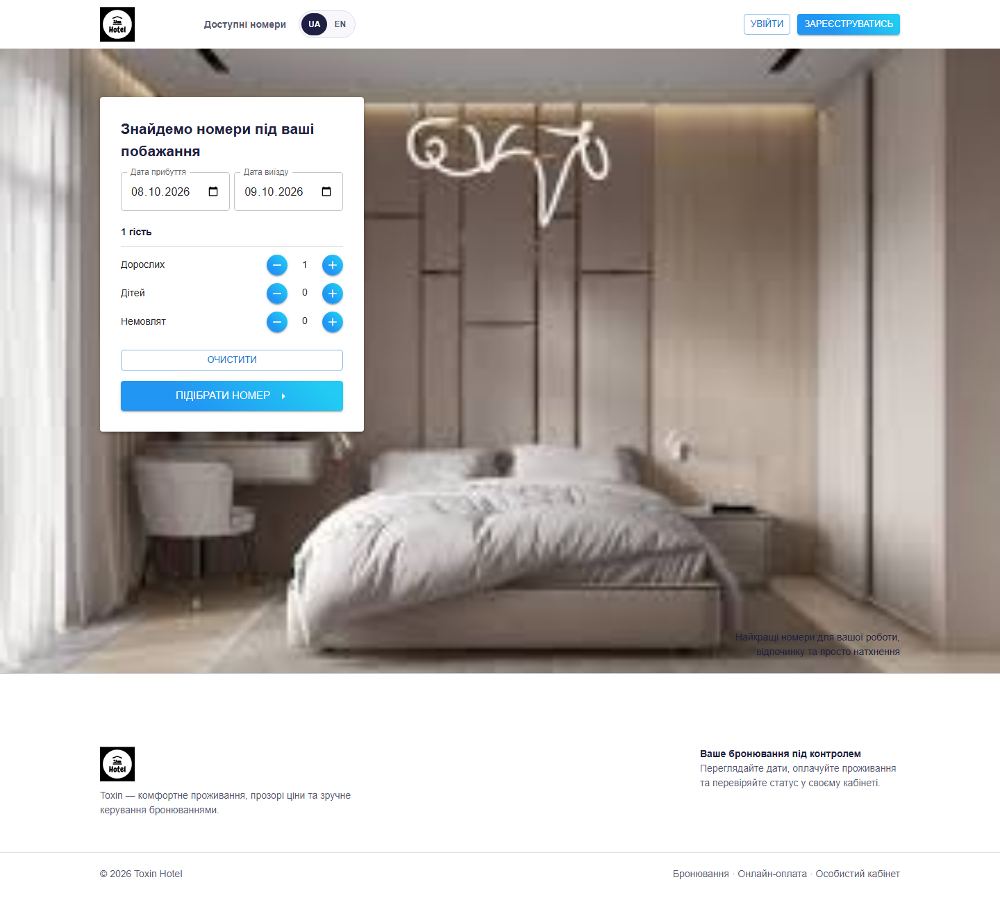
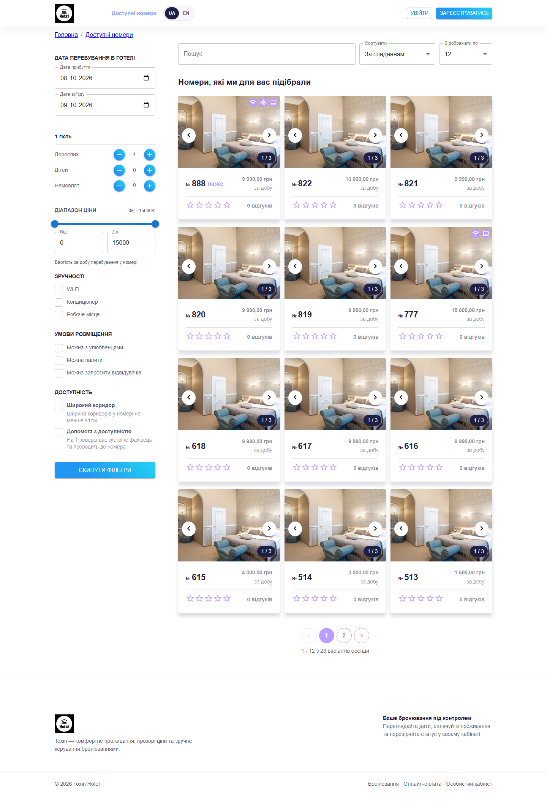
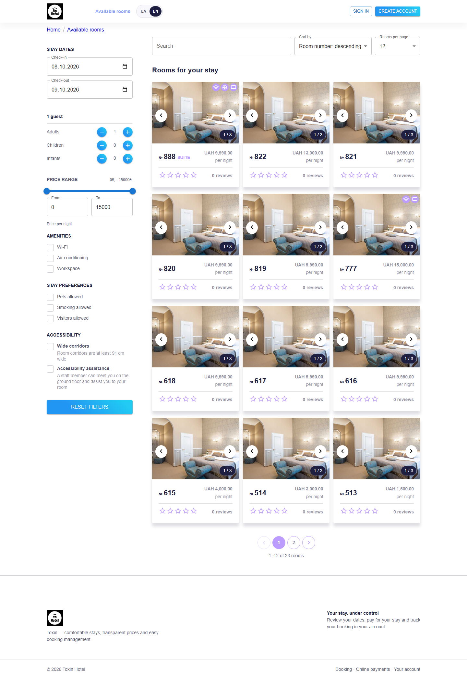
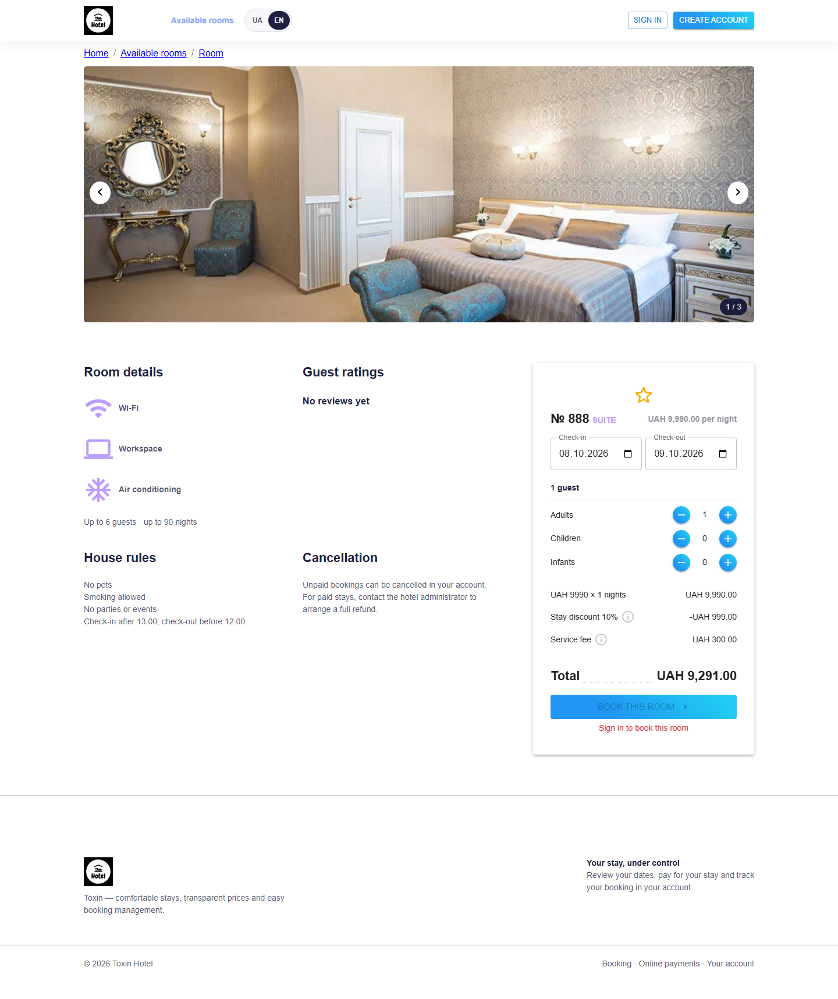
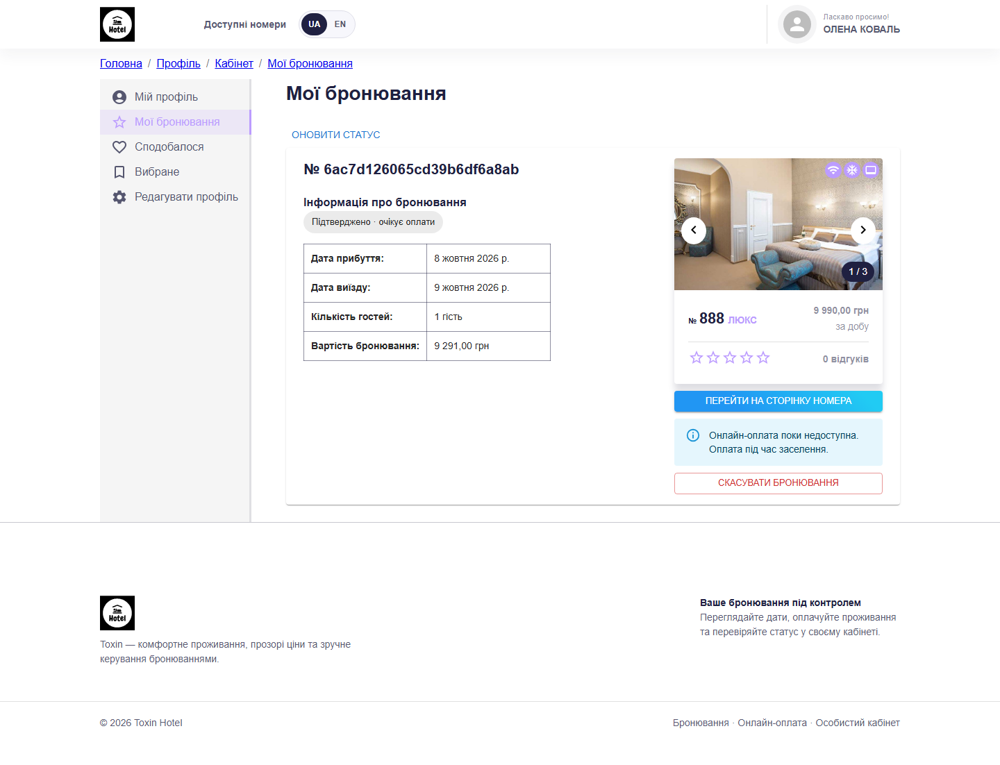
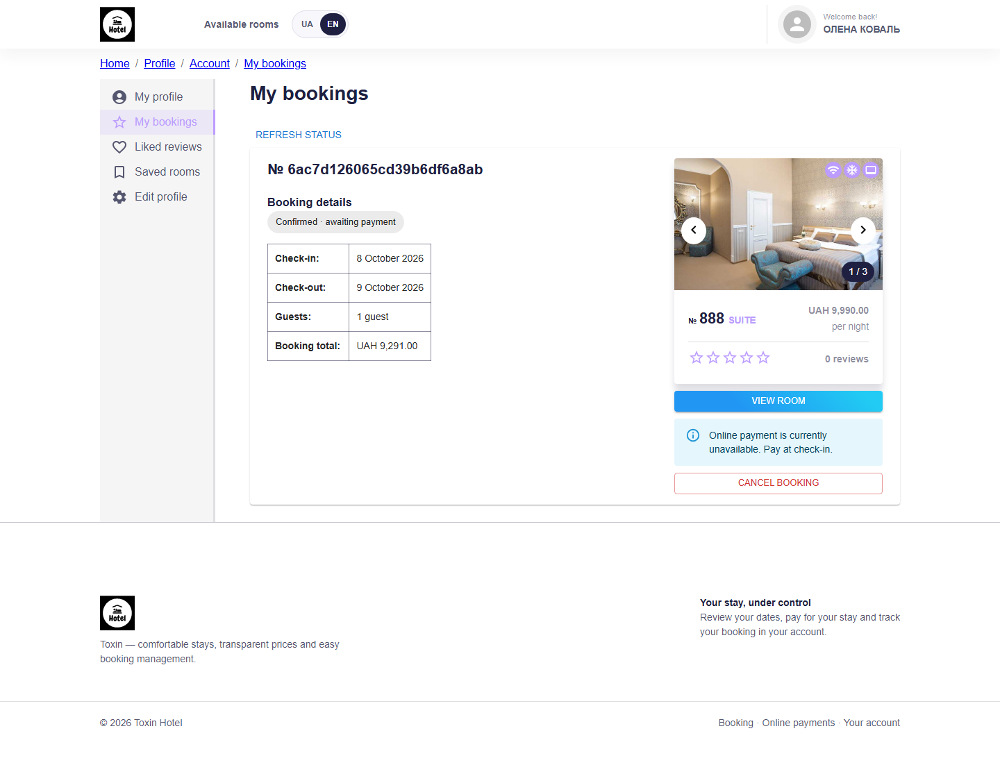
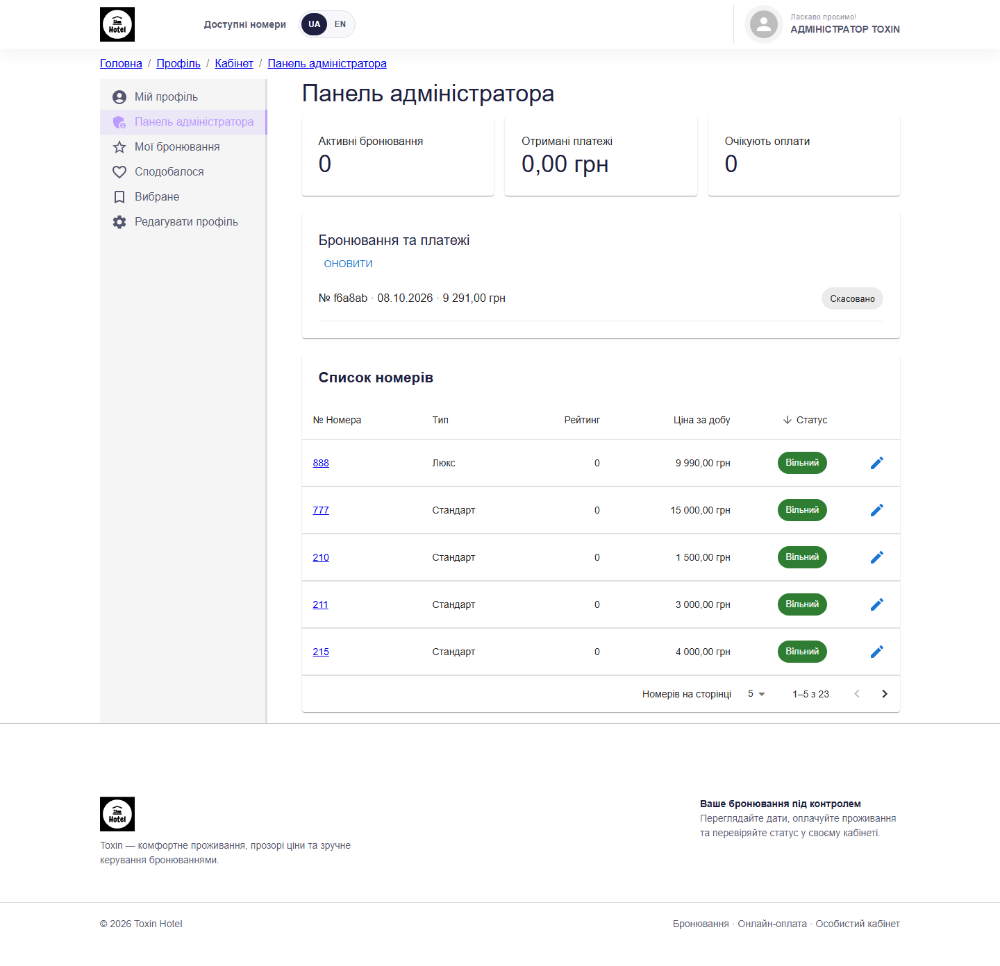
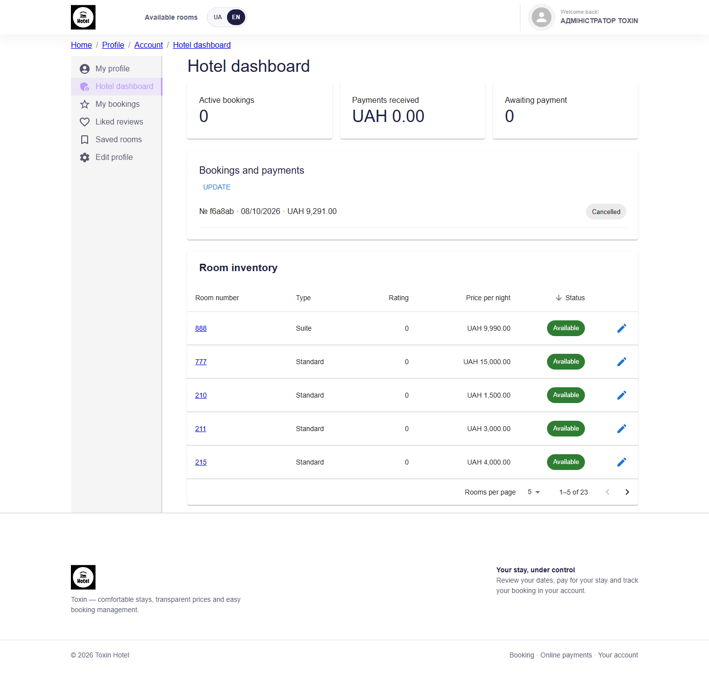
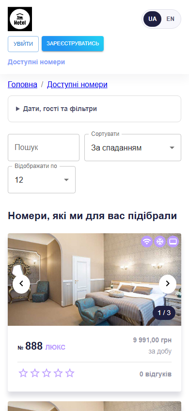
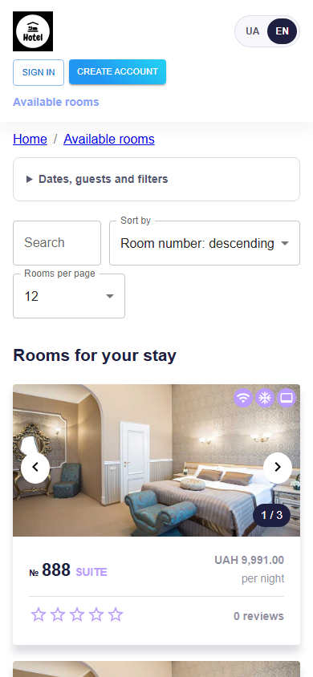

# Toxin Hotel — бронювання готелю

Пошук номерів, бронювання проживання та онлайн-оплата. Гість керує поїздками у власному кабінеті, адміністратор — номерами, бронюваннями й поверненнями коштів.

**Українська — основна мова.** Перемикач **UA / EN** у шапці змінює інтерфейс без перезавантаження та зберігає вибір у браузері. Перекладено навігацію, форми, фільтри, кабінет, адмінку, повідомлення та статуси оплати. Дати й суми форматуються відповідно до мови; валюта залишається UAH. Введені дані під час перемикання зберігаються. Імена гостей та відгуки відображаються мовою автора.

Проєкт перенесено з React 17 / Create React App / Express 4 на React 19, Vite 8 та Express 5. Активні прямі залежності зафіксовані точними версіями в npm workspaces і кореневому `package-lock.json`.

## Можливості

- **Каталог:** пошук за номером, сортування, пагінація, фільтри ціни, зручностей, правил і доступності за датами.
- **Сторінка номера:** галерея, фактичні зручності та правила, відгуки, рейтинг, обране й розрахунок вартості.
- **Обліковий запис:** реєстрація, вхід, редагування профілю та оновлення сесії.
- **Кабінет гостя:** історія бронювань, статус платежу, онлайн-оплата та скасування неоплаченого проживання.
- **Адмінка:** редагування номерів і цін, перегляд бронювань, показники платежів та повні повернення через Stripe.
- **Телефон:** адаптивні сторінки та фільтри, що згортаються; обидві мови доступні на всіх екранах.

## Скриншоти

Актуальні знімки справжнього локального деморежиму, зроблені браузерним тестом. Для кожного екрана є українська й англійська версії. Stripe Checkout не показано: потрібні ключі платіжного акаунта.

### Головна — швидкий пошук проживання

Дати, кількість гостей і перехід до доступних номерів. Мову можна змінити одразу в шапці.



<details><summary>English — home</summary>


</details>

### Каталог — порівняння номерів

Фільтри зручностей та правил, ціна за ніч, галерея, рейтинг і кількість відгуків.



<details><summary>English — room catalogue</summary>



</details>

### Номер — прозоре бронювання

Фото, зручності, умови проживання та скасування. Форма показує вартість ночей, знижку, сервісний збір і підсумок; лічильник обмежено шістьма гостями.


<details><summary>English — room and booking</summary>



</details>

### Кабінет — дати, статус і оплата

Гість бачить власні бронювання та їхній стан. Без ключів Stripe доступна оплата під час заселення; після налаштування з’являється кнопка онлайн-оплати.



<details><summary>English — guest bookings</summary>



</details>

### Адмінка — керування готелем

Показники бронювань і платежів, список номерів, зміна цін та керування поверненнями коштів.



<details><summary>English — hotel dashboard</summary>



</details>

### Мобільна версія

Каталог на екрані шириною 390 px: компактна шапка, перемикач мови та фільтри, що згортаються.



<details><summary>English — mobile catalogue</summary>



</details>

## Стек

| Частина | Технології |
| --- | --- |
| Інтерфейс | React 19, TypeScript 7, React Router 7, MUI 9, Redux Toolkit 2 |
| Збірка | Vite 8, Sass Embedded із модулями `@use` |
| API | Node.js 22.12+, Express 5, Mongoose 9 |
| База | MongoDB replica set, транзакції та унікальний індекс зайнятості |
| Оплата | Stripe Checkout, підписані webhooks, повні повернення |
| Перевірки | Node Test Runner, Supertest, тимчасовий replica set, Playwright |

Точні версії наведено в `package.json` кожного workspace. CRA, Material UI 4, MUI Lab/Styles, Moment і несумісну бібліотеку галереї виключено з активних залежностей.

## Швидкий запуск

Потрібні Node.js 22.12+ і npm. У корені репозиторію:

```sh
npm ci
```

Скопіюйте `.env.example` у `.env`, установіть `DEMO_MODE=true` та запустіть:

```sh
npm run dev
```

Інтерфейс: http://localhost:5173. API: http://localhost:8080/api. У деморежимі MongoDB завантажується автоматично під час першого запуску; Docker не потрібен. База тимчасова та скидається після перезапуску сервера, зокрема після зміни його файлів.

| Роль | Email | Пароль |
| --- | --- | --- |
| Гість | guest@example.com | DemoGuest123! |
| Адміністратор | admin@example.com | DemoAdmin123! |

Ці акаунти створюються **лише в деморежимі**. За `NODE_ENV=production` деморежим заборонений.

## Постійна локальна база

```sh
docker compose up -d --wait
```

У `.env` установіть `DEMO_MODE=false`. Приклад URI вже налаштований на локальний replica set. Для початкового наповнення:

```sh
npm run seed
npm run dev
```

Seed додає каталог лише до порожньої колекції та зберігає наявні дані. Для створення адміністратора задайте `ADMIN_EMAIL` і `ADMIN_PASSWORD` (щонайменше 12 символів). Пароль наявного акаунта seed не змінює.

## Бронювання та вартість

Бронювання підтверджується одразу та утримує номер до скасування. Оплата доступна онлайн або під час заселення. Неоплачені бронювання автоматично не спливають.

- День заїзду включений, виїзду — виключений: суміжні проживання дозволені.
- Інший номер можна забронювати на ті самі дати.
- Минулі дати, нульовий інтервал і понад 90 ночей недопустимі.
- Потрібен щонайменше один дорослий; максимум шість гостей загалом.
- Підсумок: `ціна за ніч × ночі × 0.9 + 300 ₴`, з округленням до копійки. Сервер обчислює суму та ігнорує ціну з браузера. Це єдиний тариф застосунку; зміна комерційних умов потребує зміни обох формул.
- Створення бронювання, резервування ночей та оновлення номера виконуються однією транзакцією. Унікальна пара «номер + ніч» захищає від одночасних запитів.
- Скасування зберігає історію та звільняє ночі. Оплачене проживання скасовує адміністратор після повного повернення.

API нормалізує дати до календарного дня UTC. Час заселення окремо не моделюється.

## Онлайн-оплата

1. У `.env` задайте `STRIPE_SECRET_KEY` і `STRIPE_WEBHOOK_SECRET`.
2. `CLIENT_ORIGIN` має збігатися з адресою інтерфейсу для повернення з Checkout.
3. Налаштуйте webhook `https://ваш-домен/api/payments/webhook` для подій `checkout.session.completed` та `checkout.session.async_payment_succeeded`.
4. Локально можна пересилати події через Stripe CLI:

```sh
stripe listen --forward-to localhost:8080/api/payments/webhook
```

Використайте секрет `whsec_…` з CLI як локальний `STRIPE_WEBHOOK_SECRET`. Із тестовими ключами використовуйте тестові картки Stripe.

Кнопка «Оплатити онлайн» доступна, коли задано обидва ключі. Дані картки вводяться у Stripe та не проходять через наш сервер. Підтримуються картки й UAH; доступність Stripe залежить від країни та можливостей торгового акаунта. Для англійського інтерфейсу Checkout відкривається англійською, для українського — з автоматичним вибором підтримуваної Stripe мови браузера.

Суму встановлює сервер. Сторінка успіху **не підтверджує оплату**: статус змінює лише webhook із правильним підписом, сесією, валютою та сумою. Повторні повідомлення безпечні; Checkout і повернення використовують ключі ідемпотентності.

Кнопка адміністратора «Повернути кошти» повертає повну суму. За статусу `pending` бронювання зберігається; повторіть дію після обробки Stripe для звірки. Зміни та повернення безпосередньо в Stripe Dashboard автоматично не синхронізуються.

## Перевірки та оновлення скриншотів

```sh
npm run typecheck
npm run build
npm test
npm exec playwright install chromium
npm run test:e2e
npm audit
```

API-тести працюють з окремою тимчасовою базою. Перевіряють дати, ціну, паралельні бронювання, права доступу, ролі, скасування, підпис і суму платежу, повторні webhooks та сесії.

Браузерний сценарій проходить шлях гостя й адміністратора, перевіряє обидві мови, збереження вибору після перезавантаження та даних форми під час перемикання. Перевіряє відсутність помилок і горизонтального переповнення на телефоні та оновлює **12 скриншотів** у `docs/screenshots`. Для відтворюваних демознімків запускайте його зі свіжою демобазою. CI запускає збірку, API- та браузерні тести.

Справжній Checkout і повернення потребують ваших тестових ключів Stripe та окремої пробної оплати. Dockerfile підготовлено; збірку контейнера ще не перевірено.

## Production-запуск

Установіть `NODE_ENV=production`, `DEMO_MODE=false`, робочий `MONGODB_URI` та HTTPS-адресу в `CLIENT_ORIGIN`. `ACCESS_SECRET` і `REFRESH_SECRET` мають бути незалежними випадковими рядками завдовжки щонайменше 32 символи. За довіреним зворотним проксі встановіть `TRUST_PROXY=1` (схема розрахована на один проксі).

```sh
npm ci
npm run build
npm start
```

Express віддає `client/dist` і підтримує пряме відкриття внутрішніх сторінок. Перевірка готовності бази: `GET /api/health`. Реалізовано обмеження частоти запитів і розміру JSON, Helmet, обмежений CORS та коректне завершення процесу.

```sh
docker build -t toxin-hotel .
docker run --env-file .env -p 8080:8080 toxin-hotel
```

У контейнері `MONGODB_URI` має вказувати на доступний replica set. `compose.yaml` призначений для локальної бази. HTTPS, резервні копії, моніторинг і секрети налаштовуються в середовищі розміщення.

## Перенесення наявного проєкту

1. Збережіть резервну копію MongoDB та попередні налаштування.
2. Встановіть залежності **з кореня** через `npm ci`. Старі вкладені lock-файли та `yarn.lock` більше не використовуються.
3. Перенесіть підключення бази та секрети в `.env` або сховище секретів платформи. Раніше оприлюднені дані підключення потрібно замінити у провайдера: видалення з коду не видаляє історію Git.
4. Потрібні транзакції: MongoDB Atlas або replica set. Standalone MongoDB не підходить.
5. Наявні бронювання без `status` вважаються активними під час перевірки перетину. Індекс зайнятості створюється при запуску; попередні конфлікти бронювань потрібно перевірити перед перенесенням.
6. Нові JWT-секрети потребують повторного входу. Seed більше не очищає колекції та не запускається автоматично у звичайному режимі.
7. Зберіть інтерфейс у `client/dist`. Старі `server/client` та конфіги збережено; новий сервер їх не використовує.

Токени сесії наразі зберігаються в localStorage. Для середовищ із підвищеними вимогами передбачте перенесення refresh-токена в HttpOnly cookie. Поштові повідомлення, відновлення пароля, податки/чеки, часткові повернення та інтеграції з PMS ще не реалізовані.

## English overview

Toxin Hotel provides room search, availability filters, booking, guest accounts and a hotel dashboard. Ukrainian is the default language; **UA / EN** switches the interface instantly and remembers your choice without clearing form data. Dates and money follow the selected locale; payments remain in UAH. Expand the English screenshot sections above to preview each screen.

Requires Node.js 22.12+. Run `npm ci`, copy `.env.example` to `.env`, set `DEMO_MODE=true`, then run `npm run dev`. Open http://localhost:5173. Demo credentials are listed above; the demo database resets on server restart. For Stripe payments configure both Stripe secrets and a signed webhook. Real payment testing requires your Stripe test account. Production requires a persistent MongoDB replica set, strong JWT secrets, HTTPS and your deployment infrastructure.

## Структура

```text
client/src/app/      інтерфейс, стан та API-клієнти
client/src/app/i18n/ переклади, вибір мови та форматування
server/routes/      API та Stripe
server/services/    бронювання та токени
server/models/      MongoDB-моделі та індекс зайнятості
server/test/        інтеграційні перевірки API
tests/              браузерний сценарій
docs/screenshots/   знімки обома мовами для README
```
